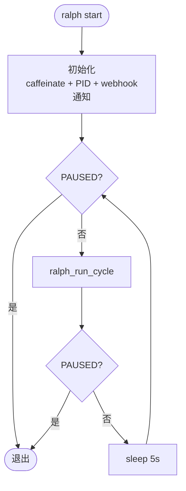
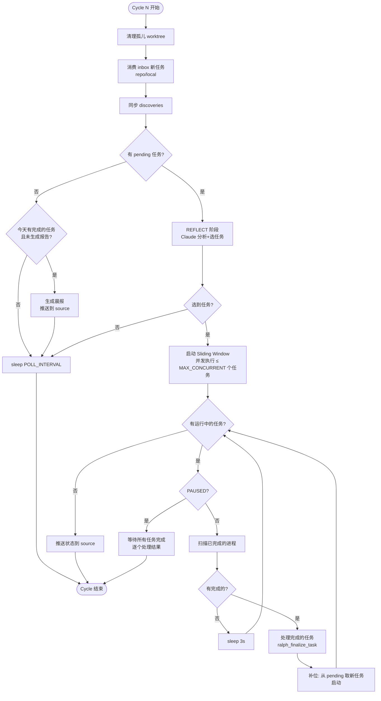
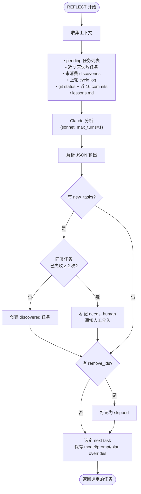
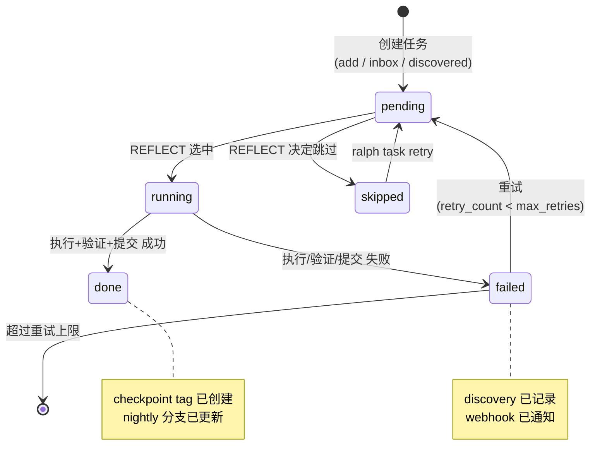
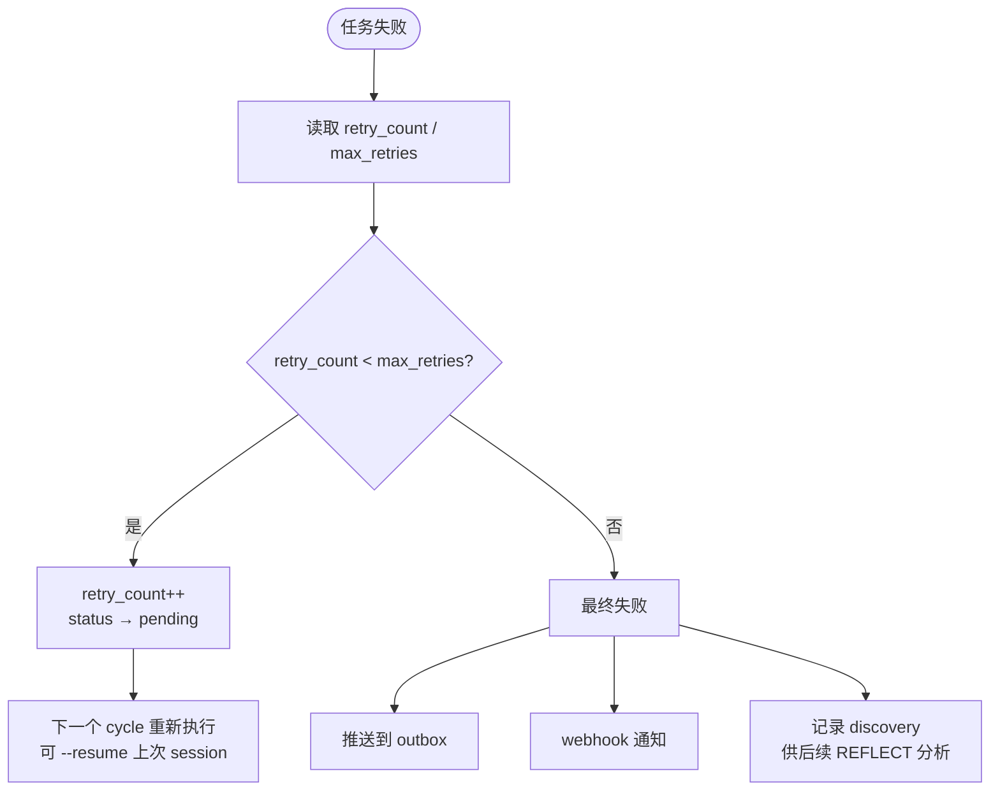
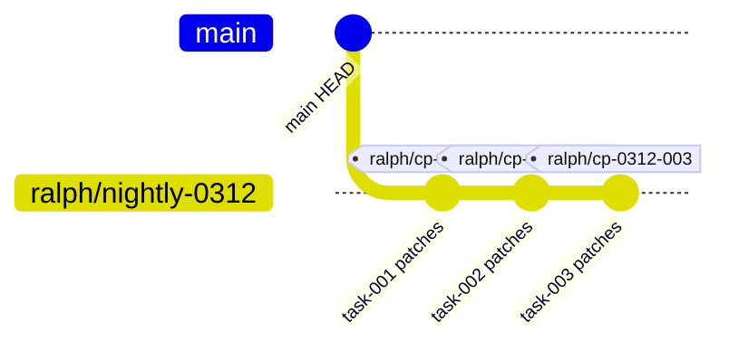
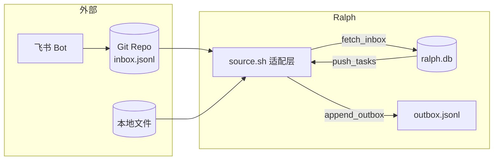
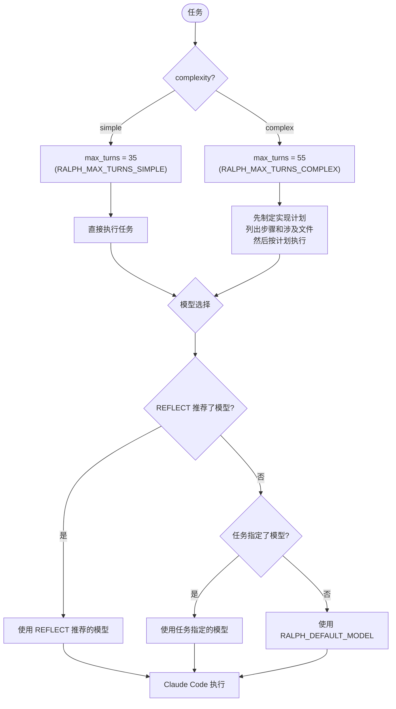

# Ralph CLI 架构与流程

## 总体架构

Ralph CLI 是一个自动化任务编排系统。**Ralph 只管"做什么"（调度、worktree、nightly 分支），Claude Code 管"怎么做"（改代码、验证、修复、提交）。**

```
┌─────────────────────────────────────────────────────────┐
│                     Ralph CLI (Bash)                     │
│                                                         │
│  ralph.sh ──→ 用户命令入口 (add/start/stop/merge/...)   │
│  loop.sh  ──→ 主循环 (后台常驻进程)                      │
│                                                         │
│  ┌── lib/ ──────────────────────────────────────────┐   │
│  │ config.sh   配置加载 (env > yaml > defaults)     │   │
│  │ log.sh      日志 (文件 + JSONL 日志)             │   │
│  │ db.sh       数据库 shim (调用 ralph-db)          │   │
│  │ source.sh   任务源适配 (repo/local)            │   │
│  │ reflect.sh  反思+分诊 (Claude 选任务)            │   │
│  │ execute.sh  执行 (Claude Code 单次 session)      │   │
│  │ verify.sh   验证 (最终确认)                      │   │
│  │ commit.sh   提交 (patch → nightly + tag)         │   │
│  │ webhook.sh  通知 (飞书/钉钉)                     │   │
│  │ report.sh   晨报生成                             │   │
│  └──────────────────────────────────────────────────┘   │
│                                                         │
│  bin/ralph-db ──→ Python 数据层 (SQLite + JSON)         │
└─────────────────────────────────────────────────────────┘
```

---

## 主循环流程



---

## 单 Cycle 详细流程



---

## REFLECT 阶段



---

## 单任务生命周期（核心流程）

```mermaid
flowchart TD
    T_START([任务开始<br/>status: running]) --> WT_CREATE["创建 git worktree<br/>/tmp/ralph-wt-PROJECT-TASK_ID<br/>branch: ralph/task-TASK_ID"]
    WT_CREATE --> WT_BASE["确定 base_ref<br/>优先 nightly 分支, fallback HEAD"]
    WT_BASE --> SYMLINK["符号链接 node_modules<br/>(如果启用)"]
    SYMLINK --> PROMPT["构建增强 prompt:<br/>• 任务指令<br/>• context-brief.md<br/>• lessons.md<br/>• verify commands<br/>• commit 规范<br/>• 复杂度提示"]

    PROMPT --> CLAUDE_EXEC["Claude Code 单次 session<br/>claude -p --dangerously-skip-permissions<br/>(改代码 + 验证 + 提交)"]

    CLAUDE_EXEC --> CHECK_COMMITS{worktree 有新 commit?}

    CHECK_COMMITS -- 是 --> VERIFY
    CHECK_COMMITS -- 否 --> UNCOMMITTED{有未提交的改动?}
    UNCOMMITTED -- 是 --> ASK_COMMIT["追加 prompt: 请提交<br/>--resume session, max 5 turns"]
    ASK_COMMIT --> RECHECK{有新 commit?}
    RECHECK -- 是 --> VERIFY
    RECHECK -- 否 --> ESCALATE_RETRY

    UNCOMMITTED -- 否 --> ESCALATE_RETRY["升级重试<br/>max_turns + 15<br/>新 prompt: 请直接修改文件"]
    ESCALATE_RETRY --> FINAL_CHECK{有新 commit?}
    FINAL_CHECK -- 是 --> VERIFY
    FINAL_CHECK -- 否 --> EXEC_FAIL([标记失败<br/>No changes made])

    VERIFY["VERIFY 阶段<br/>运行验证命令<br/>(trust-but-verify)"]
    VERIFY --> V_RESULT{验证通过?}
    V_RESULT -- 否 --> V_FAIL([标记失败<br/>rollback worktree])
    V_RESULT -- 是 --> COMMIT_PHASE

    COMMIT_PHASE["COMMIT 阶段"] --> NIGHTLY["确保 nightly 分支存在<br/>ralph/nightly-MMDD"]
    NIGHTLY --> FORMAT_PATCH["git format-patch<br/>base_ref..HEAD → patches"]
    FORMAT_PATCH --> NIGHTLY_WT["创建 nightly worktree<br/>/tmp/ralph-nightly-$$"]
    NIGHTLY_WT --> APPLY["应用 patches"]
    APPLY --> AM{git am --3way<br/>成功?}
    AM -- 是 --> TAG
    AM -- 否 --> APPLY_FALLBACK["git apply --3way<br/>+ git commit"]
    APPLY_FALLBACK --> FB_OK{成功?}
    FB_OK -- 否 --> C_FAIL([标记失败<br/>rollback worktree])
    FB_OK -- 是 --> TAG

    TAG["创建 checkpoint tag<br/>ralph/cp-MMDD-NNN"] --> CHANGESET{changeset 启用?}
    CHANGESET -- 是 --> GEN_CHANGESET["生成 .changeset/ 文件<br/>amend commit"]
    CHANGESET -- 否 --> CLEANUP
    GEN_CHANGESET --> CLEANUP

    CLEANUP["清理<br/>• nightly worktree<br/>• task worktree<br/>• task branch<br/>• patch 文件<br/>• 临时文件"] --> UPDATE["更新状态<br/>• status → done<br/>• context-brief.md<br/>• outbox<br/>• webhook 通知"]
    UPDATE --> T_END([任务完成])
```



---

## 任务状态机



---

## 重试机制



---

## Git 分支与 Worktree 策略



### Worktree 生命周期

```
主仓库 (RALPH_CWD)
  │
  ├── /tmp/ralph-wt-PROJECT-task001     ← task worktree (执行期间)
  │     branch: ralph/task-task001
  │     base: ralph/nightly-MMDD 或 HEAD
  │
  ├── /tmp/ralph-nightly-$$             ← nightly worktree (提交期间, 临时)
  │     branch: ralph/nightly-MMDD
  │
  └── (完成后所有 worktree 清理)
```

**关键设计：** 使用临时 worktree 操作 nightly 分支，不影响主仓库的 checkout 状态。开发者可以在主仓库正常工作，Ralph 在后台执行任务互不干扰。

---

## 任务源适配



| 适配器 | 文件 | 传输方式 | 适用场景 |
|--------|------|---------|---------|
| `source-repo.sh` | inbox.jsonl / tasks.jsonl | git clone + pull/push | 生产环境，多人协作 |
| `source-local.sh` | 本地目录 | 直接读写 | 开发调试 |

---

## 通知与报告

### Webhook 事件

通过 `RALPH_NOTIFY_EVENTS` 配置可控制只接收关心的事件通知（逗号分隔），默认 `all` 发送所有事件。

| 事件 | 触发时机 | 内容 |
|------|---------|------|
| `service_started` | ralph start | PID, 并发数 |
| `service_stopped` | ralph stop / 进程退出 | PID, 原因 |
| `task_started` | 任务开始执行 | 任务标题, 模型, 复杂度 |
| `task_done` | 任务完成 | checkpoint tag |
| `task_failed` | 任务失败(最终) | 失败原因 |
| `needs_human` | 多次失败需人工 | 任务详情 |
| `report` | 晨报生成 | 报告内容 |

### 晨报生成

自动触发条件：当天有已完成任务 + 无新 pending 任务时自动生成（每天仅一次）。

内容：
- 总览（任务数、完成率）
- 每个任务详情（checkpoint、改动、风险点）
- 注意事项（高风险、失败任务、新 discoveries）
- 快速操作命令（merge / cherry-pick / revert）

---

## 配置系统

### 配置层级

```
优先级从高到低:

  环境变量 (RALPH_*)          ← 最高优先级，适合临时覆盖
       ↓
  ~/.ralph/config.yaml        ← 全局配置，跨项目共享
       ↓
  $CWD/.ralph.yaml            ← 项目端配置，提交到 git
       ↓
  config.sh 内置默认值         ← 兜底
```

### 配置文件说明

#### 全局配置 `~/.ralph/config.yaml`

安装时从 `config.yaml.example` 复制，跨项目共享的通用设置。使用扁平 `KEY: value` 格式（注意 key 是大写 `RALPH_` 前缀）。

```yaml
# 任务源类型: repo | local
RALPH_SOURCE: repo

# Git 仓库地址（repo 源）
RALPH_INBOX_REPO: git@github.com:your-user/your-inbox.git

# 无任务时轮询间隔（秒）
RALPH_POLL_INTERVAL: 600

# 任务执行默认模型
RALPH_DEFAULT_MODEL: claude-sonnet-4-6

# Reflect 阶段模型
RALPH_REFLECT_MODEL: claude-sonnet-4-6

# 简单任务最大轮次（单次 session 含 execute + verify + commit）
RALPH_MAX_TURNS_SIMPLE: 35

# 复杂任务最大轮次
RALPH_MAX_TURNS_COMPLEX: 55

# Webhook URL（留空则不发送通知）
# RALPH_WEBHOOK_URL: https://hooks.example.com/your-webhook
```

#### 项目配置 `.ralph.yaml`

放在项目根目录，支持嵌套结构（一层）。key 为小写，自动映射到 `RALPH_` 前缀变量。

```yaml
project: my-project            # 项目标识（不填则从 git remote 推导）

verify:
  symlink_node_modules: true   # 自动 ln -s 主项目 node_modules 到 worktree
  commands:
    - pnpm type-check          # 验证命令（可配多个，按顺序执行）
    - pnpm test:priority

changeset:
  enabled: false               # 是否创建 changeset（自动版本管理）
  package: my-package           # changeset 包名

merge_target: main             # ralph merge 的目标分支
skip_hooks: true               # HUSKY=0 + --no-verify（跳过 git hooks）
default_model: claude-sonnet-4-6  # 覆盖全局默认模型

# 可覆盖全局配置
# source: repo
# inbox_repo: git@github.com:user/inbox.git
# webhook_url: https://...
```

### 全部配置项参考

#### 任务源

| 配置项 | 配置文件 | 默认值 | 说明 |
|--------|---------|--------|------|
| `RALPH_SOURCE` | 全局 / 项目 | `repo` | 任务源类型: `repo` / `local` |
| `RALPH_INBOX_REPO` | 全局 / 项目 | — | Git 仓库地址（repo 源必填） |
| `RALPH_POLL_INTERVAL` | 全局 | `300` | 无任务时轮询间隔（秒） |

#### 模型配置

| 配置项 | 配置文件 | 默认值 | 说明 |
|--------|---------|--------|------|
| `RALPH_DEFAULT_MODEL` | 全局 / 项目 | `claude-sonnet-4-6` | 任务执行使用的模型 |
| `RALPH_REFLECT_MODEL` | 全局 | `claude-sonnet-4-6` | REFLECT 阶段使用的模型 |

**模型选择策略（优先级从高到低）：**

1. **REFLECT 动态推荐** — REFLECT 阶段 Claude 可以在 `next.model` 中建议使用的模型（如对复杂任务推荐 opus）
2. **任务级指定** — `ralph add --model claude-opus-4-6` 或 inbox JSONL 中的 `model` 字段
3. **项目配置** — `.ralph.yaml` 中的 `default_model`
4. **全局配置** — `~/.ralph/config.yaml` 中的 `RALPH_DEFAULT_MODEL`
5. **内置默认** — `claude-sonnet-4-6`

#### 执行限制

| 配置项 | 配置文件 | 默认值 | 说明 |
|--------|---------|--------|------|
| `RALPH_MAX_TURNS_SIMPLE` | 全局 | `35` | 简单任务最大轮次 |
| `RALPH_MAX_TURNS_COMPLEX` | 全局 | `55` | 复杂任务最大轮次 |
| `RALPH_MAX_CONCURRENT` | 全局 | `3` | 最大并发任务数 |

> 单次 session 包含 execute + verify + commit 全流程，所以 turns 设置较高。Claude 在 session 内自行运行验证命令并修复问题，不会浪费 turns。

#### 验证配置

| 配置项 | 配置文件 | 默认值 | 说明 |
|--------|---------|--------|------|
| `RALPH_VERIFY_COMMANDS` | 项目 (列表) | — | 验证命令列表，按顺序执行 |
| `RALPH_VERIFY_SYMLINK_NODE_MODULES` | 项目 | `true` | 自动符号链接 node_modules |

验证命令的作用：
- **执行阶段**：注入到 Claude prompt 中，Claude 在 session 内自行运行并修复
- **验证阶段**：Ralph 再跑一遍做最终确认（trust-but-verify）

#### 提交配置

| 配置项 | 配置文件 | 默认值 | 说明 |
|--------|---------|--------|------|
| `RALPH_SKIP_HOOKS` | 项目 | `true` | 跳过 git hooks (HUSKY=0 + --no-verify) |
| `RALPH_MERGE_TARGET` | 项目 | `main` | `ralph merge` 的目标分支 |
| `RALPH_CHANGESET_ENABLED` | 项目 | `false` | 是否自动创建 changeset |
| `RALPH_CHANGESET_PACKAGE` | 项目 | — | changeset 包名（启用时必填） |

#### 通知配置

| 配置项 | 配置文件 | 默认值 | 说明 |
|--------|---------|--------|------|
| `RALPH_WEBHOOK_URL` | 全局 / 项目 | — | Webhook 地址（飞书/钉钉/Slack） |
| `RALPH_NOTIFY_EVENTS` | 全局 / 项目 | `all` | 通知事件过滤（逗号分隔），可选: `task_started`, `task_done`, `task_failed`, `needs_human`, `service_started`, `service_stopped`, `report` |
| `RALPH_VERBOSE` | 全局 / 环境变量 | `false` | 启用 DEBUG 级别日志输出 |

#### 项目识别

| 配置项 | 配置文件 | 默认值 | 说明 |
|--------|---------|--------|------|
| `RALPH_PROJECT` | 项目 / 环境变量 | 自动推导 | 项目标识 slug |
| `RALPH_CWD` | 环境变量 | `git rev-parse --show-toplevel` | 项目根目录 |
| `RALPH_HOME` | 环境变量 | `~/.ralph` | Ralph 数据根目录 |

---

### 复杂度与模型：任务如何被执行

任务通过 `complexity` 字段区分简单/复杂，影响 Claude 的执行方式和资源分配：



#### 复杂度（complexity）

| 值 | max_turns | prompt 行为 | 适用场景 |
|----|-----------|------------|---------|
| `simple` | 35 | 直接执行任务 | 单文件修改、bug 修复、小功能 |
| `complex` | 55 | 先制定计划再执行 | 多文件重构、新功能、架构改动 |

**设置方式：**
- `ralph add --complexity complex` — 手动添加时指定
- inbox JSONL 中的 `complexity` 字段
- REFLECT 阶段可将 `plan_first: true` 设为 complex

**复杂任务的 plan 行为：**

当 `complexity=complex` 时，注入到 Claude prompt 中的提示为：

> 注意: 这是一个复杂任务。在动手修改前，先制定实现计划（列出步骤和涉及文件），然后按计划执行。

Claude 在单次 session 内自主完成"规划 → 执行 → 验证 → 提交"全流程。Ralph 不会做额外的 planning 调用。

#### REFLECT 自动调整

REFLECT 阶段（由 Claude 驱动）可以动态调整任务执行参数：

| REFLECT 输出字段 | 作用 | 示例 |
|-----------------|------|------|
| `next.model` | 覆盖任务的执行模型 | 对复杂任务推荐 `claude-opus-4-6` |
| `next.enhanced_prompt` | 增强任务 prompt（加入上下文、更精确的指令） | 基于失败原因给出更具体的修复指令 |
| `next.plan_first` | 设为 `true` 时升级为 complex | 判断简单任务实际需要规划 |

这意味着即使用户添加任务时没有指定模型或复杂度，REFLECT 也能根据任务内容和历史经验自动做出调整。

#### 模型配置示例

```yaml
# .ralph.yaml — 项目级默认模型
default_model: claude-sonnet-4-6
```

```bash
# 手动添加时指定模型 + 复杂度
ralph add \
  --title "重构认证系统" \
  --prompt "将 JWT 认证迁移到 session-based 认证" \
  --model claude-opus-4-6 \
  --complexity complex

# 简单任务使用默认模型
ralph add \
  --title "修复拼写错误" \
  --prompt "修复 README.md 中的拼写错误"
```

```jsonl
// inbox.jsonl — 外部提交的任务
{"title":"添加 dark mode","prompt":"...","model":"claude-opus-4-6","complexity":"complex"}
{"title":"修复 CSS 对齐","prompt":"..."}
```

---

## 数据目录结构

```
~/.ralph/
├── bin/
│   ├── ralph          → ralph.sh
│   └── ralph-db       → Python 数据层
├── lib/               → Bash 模块
├── config.yaml        → 全局配置
├── projects/
│   └── <project-slug>/
│       ├── ralph.db           SQLite 数据库
│       ├── ralph.log          运行日志
│       ├── ralph.pid          进程 PID
│       ├── PAUSED             暂停标记文件
│       ├── context-brief.md   近期任务摘要 (注入 Claude prompt)
│       ├── lessons.md         经验教训 (注入 Claude prompt)
│       ├── discoveries.md     发现的问题
│       ├── logs/
│       │   └── YYYY-MM-DD.jsonl   每日事件日志
│       ├── reports/
│       │   └── report-YYYY-MM-DD.md
│       ├── inbox-repo/        (repo 源) 本地 clone
│       └── local-source/      (local 源) 本地文件
└── templates/
```
